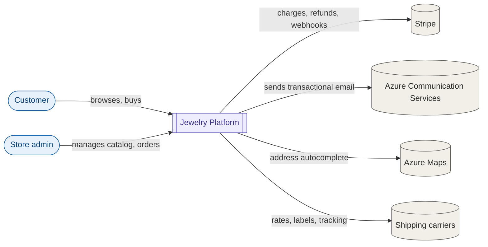
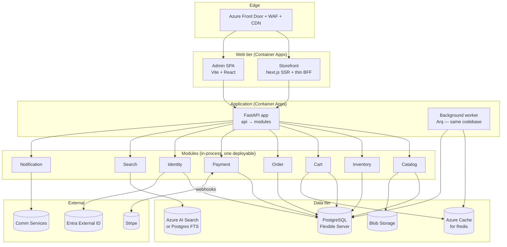
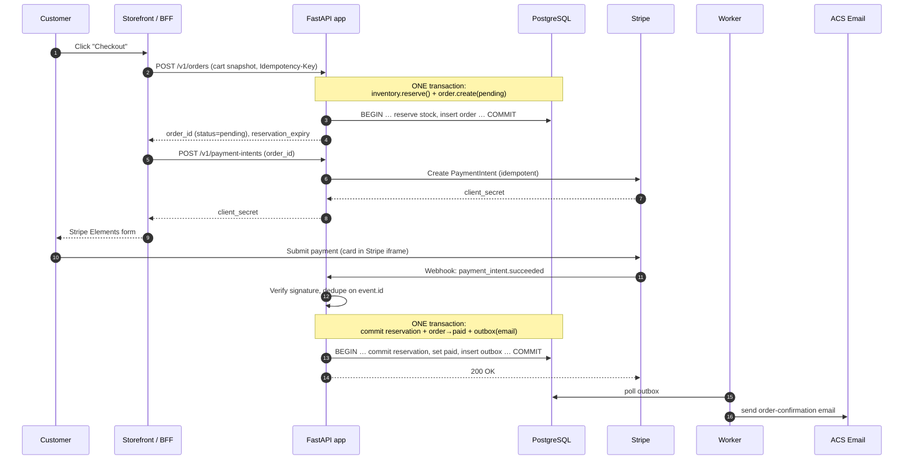
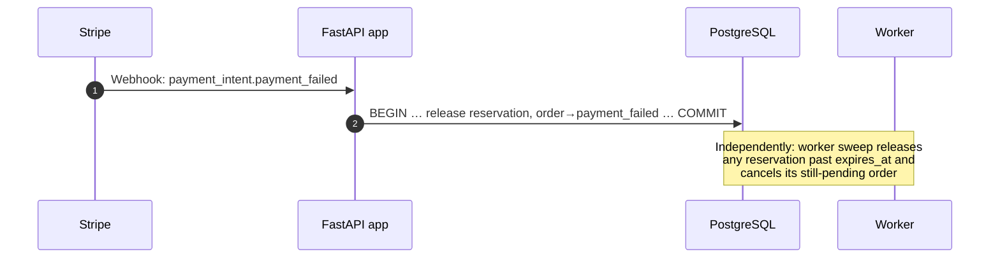
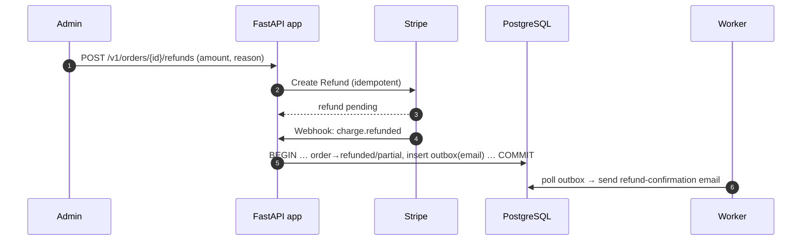
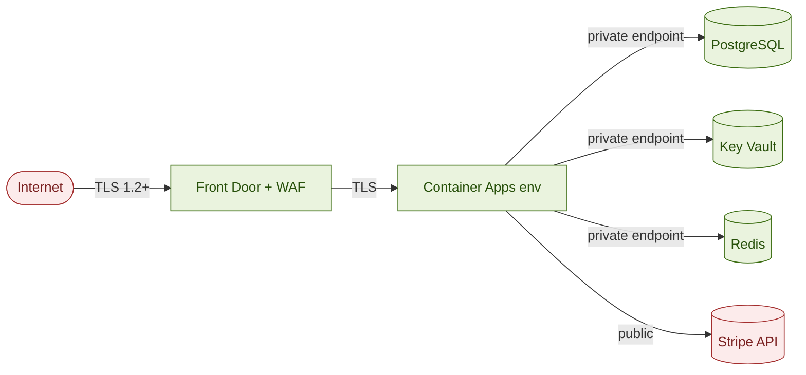
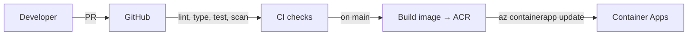

# Jewelry Ecommerce Platform — Architecture

**Status:** v2 (right-sized)
**Scope:** MVP architecture for a single-tenant, Shopify-style jewelry ecommerce platform.
**Audience:** Engineering team, Claude Code agents implementing the platform.

> This document was deliberately right-sized down from an 8-service distributed AKS design. The rationale for the altitude is in `docs/right-sizing.md` — read it if you're tempted to add a service, a mesh, or a second message broker.

---

## 1. Executive Summary

We are building a custom ecommerce platform — not using Shopify or any commerce SaaS. The system is a **modular monolith**: a single Python/FastAPI application internally decomposed into bounded-context **modules** (Catalog, Inventory, Cart, Order, Payment, Identity, Search, Notification) that talk only through narrow interfaces. PostgreSQL is the single primary store; Redis handles cache, idempotency keys, and the background-job queue; a small outbox bridges the two genuinely external async edges (Stripe webhooks, transactional email). Stripe handles payments via Elements (no card data crosses our trust boundary).

The application runs on **Azure Container Apps** (no Kubernetes cluster to operate) behind Azure Front Door (CDN + WAF). The storefront is a Next.js SSR app for SEO and Core Web Vitals; the admin is a React SPA. The storefront keeps a thin BFF only to hold auth tokens server-side; the admin calls the API directly.

The MVP delivers eight modules in one deployable, plus one background-worker process sharing the same codebase.

**Key non-negotiables:**

- PCI scope minimized to Stripe-hosted surfaces only.
- All secrets in Azure Key Vault, surfaced via Container Apps managed identity.
- Module boundaries enforced in code: a module reaches another only through its `service.py` interface, never its tables.
- OpenTelemetry traces, logs, and metrics into Application Insights.
- Idempotency on every payment and order mutation.

---

## 2. Architectural Drivers

| Driver | Implication |
|---|---|
| **Operate at small scale** | ~100 orders/day, ~10k SKUs. One deployable, one database, one queue. No premature distribution. |
| **Single tenant** | No tenancy column in schemas, no per-tenant routing. |
| **SEO is revenue** | SSR storefront, structured data (`Product`, `Offer`, `Review`), sitemap.xml, hreflang-ready. |
| **PCI scope minimization** | Stripe Elements only. No raw PAN, CVV, or expiry in our network, logs, or storage. |
| **Inventory integrity** | Strong consistency on stock reservations. Cannot oversell a one-of-a-kind ring. Local ACID, not sagas. |
| **Personalization (engraving)** | Cart line items carry structured custom-attribute payloads; persisted to orders verbatim. |
| **Mobile-first** | Storefront budget: TTI < 3s on 4G, JS bundle < 200KB initial. |
| **Optionality on growth** | Module boundaries clean enough to *extract* a service later without rewriting domain code. |

---

## 3. System Context (C4 L1)



---

## 4. Container View (C4 L2)



In-process domain events flow over an event bus inside the app; the **only** durable async handoffs are the outbox at the Stripe and email edges, drained by the worker.

---

## 5. Module Catalog (MVP)

Each module owns its tables and exposes a single `service.py` interface. **No module reads another module's tables.** Cross-module reads go through the owning module's service; cross-module facts flow over the in-process event bus.

| Module | Responsibility | Owns tables | Emits events |
|---|---|---|---|
| **Catalog** | Products, variants, categories, collections, media metadata | `catalog_*` | `ProductCreated`, `ProductUpdated`, `ProductArchived` |
| **Inventory** | Stock levels per variant, reservations, low-stock alerts | `inventory_*` | `StockReserved`, `StockReleased`, `StockDepleted`, `LowStockReached` |
| **Cart** | Active carts, line items, applied promo codes, custom attributes (engraving) | Redis (active) + `cart_converted` (audit) | `CartAbandoned` (delayed), `CartConverted` |
| **Order** | Order lifecycle, state machine, fulfillment tracking, returns | `order_*` | `OrderCreated`, `OrderPaid`, `OrderShipped`, `OrderRefunded`, `OrderCancelled` |
| **Payment** | Stripe integration, intents, webhooks, refunds | `payment_*` | `PaymentSucceeded`, `PaymentFailed`, `RefundProcessed` |
| **Identity** | Customer profiles, addresses, auth integration with Entra External ID | `identity_*` | `CustomerRegistered`, `CustomerUpdated` |
| **Search** | Product index, faceted search, autocomplete | AI Search index / Postgres FTS (projection of Catalog + Inventory) | — (consumer only) |
| **Notification** | Transactional email rendering and delivery via ACS | `notification_*` (logs only) | `NotificationSent`, `NotificationFailed` |

### Out of MVP (deferred to v2)

Pricing & Promotion (beyond simple discount codes), Review, Recommendation, Analytics, and **any extraction of a module into a standalone service** (see §13, ADR-002).

---

## 6. Azure Service Selection

| Concern | Choice | Rationale | Alternatives considered |
|---|---|---|---|
| Compute | **Azure Container Apps** | Serverless containers, scale-to-N, no cluster to operate. Run the API app (2–3 replicas) + one worker app | AKS — operationally heavy for one deployable; App Service — viable, less flexible scaling |
| Ingress / edge | **Azure Front Door Premium** (CDN + WAF) | Global edge, WAF, CDN in one | App Gateway — loses CDN co-location |
| Primary DB | **PostgreSQL Flexible Server** (single instance) | One store, module-prefixed tables, one DB user; zone-redundant HA when needed | DB-per-module — premature; Cosmos — premature cost |
| Cache / queue | **Azure Cache for Redis** (Standard C1) | Cart, idempotency keys, Arq job queue, rate-limit counters | In-memory — loses cart on restart |
| Background jobs | **Arq** (Redis-backed) | Lean async worker for email send, reservation sweep, abandoned-cart | Celery — heavier; fine if Arq proves limiting |
| Search | **Azure AI Search** (Basic), or **Postgres FTS** for MVP | FTS handles 10k SKUs; move to AI Search when facet/relevance needs grow | Elastic — ops burden |
| Object storage | **Blob Storage** (Hot tier, RA-GRS) | Product images, originals + derivatives | — |
| CDN | **Front Door** built-in CDN | Co-located with WAF | Azure CDN — separate config |
| Customer auth | **Entra External ID** (formerly Azure AD B2C) | OIDC/OAuth2, social IdP federation, password reset, MFA | Auth0 — vendor + egress |
| Admin auth | **Entra ID** (workforce tenant) | RBAC via groups, Conditional Access, audit log | — |
| Secrets | **Key Vault** + Container Apps managed identity | Secrets referenced at deploy, rotated in vault | Secrets in config — never |
| Email | **Azure Communication Services Email** | Native Azure, managed bounce/complaint | SendGrid — viable for marketing in v2 |
| Maps / address | **Azure Maps** | Native, single billing | Google Maps — separate vendor |
| Container registry | **Azure Container Registry** (Standard) | Integrates with Container Apps | GHCR — cross-cloud egress |
| IaC | **Bicep** + `azd` | Native, strong typing | Terraform — viable; pick one |
| CI/CD | **GitHub Actions** | One pipeline: test → build → deploy to Container Apps | — |
| Observability | **Application Insights** + **Log Analytics** | OpenTelemetry-native, single Azure Monitor surface | Datadog — egress + cost |
| WAF | **Front Door WAF (Premium)** | OWASP CRS, custom rules, bot protection | — |

---

## 7. Data Architecture

### 7.1 Persistence pattern

One **PostgreSQL Flexible Server**, one database. Each module owns a set of **prefix-namespaced tables** (`catalog_products`, `order_orders`, …). The isolation rule is enforced by convention + an import/lint check: a module's `repository.py` queries only its own prefix; no joins across module prefixes; cross-module data is fetched through the owning module's `service.py`.

Why one database (not DB-per-module yet):

- A single store ≈ $200/mo; eight separate stores ≈ $1.4k+/mo.
- One HA setup, one backup policy, one migration history (Alembic).
- The table-prefix discipline gives the same decoupling as schema-per-service. We can split a module to its own database the day it earns it (§13) by pointing its repository at a new connection — domain code unchanged.

### 7.2 Read models

**Search** owns a denormalized projection (AI Search index or Postgres FTS) built from `ProductCreated/Updated/Archived` and `StockReserved/Released` events on the in-process bus. Eventual consistency within the process; rebuildable from current Catalog + Inventory state on cold start.

### 7.3 Transactional consistency

- **Within the process (the normal case):** a single SQL transaction. Checkout reserves stock **and** creates the order in **one transaction** — no saga, no compensation. If the transaction fails, nothing is reserved.
- **Across the two external edges:** the **transactional outbox**. When Payment records a Stripe result or Order needs to trigger email, it writes business state **and** an `outbox_messages` row in the same transaction; the worker drains the outbox to Stripe/ACS with at-least-once delivery. Handlers are idempotent.
- We do **not** use distributed transactions, and we do **not** introduce sagas while everything is in one process. (A saga reappears only if a module is later extracted — §13, ADR-005.)

### 7.4 Idempotency

- All POST endpoints that mutate state accept an `Idempotency-Key` header.
- Server stores `(key, request_hash, response)` in Redis with 24h TTL.
- Duplicate request with same key + same body returns the cached response. Different body with same key returns 409.
- Stripe webhooks dedupe on the upstream `event.id`.

---

## 8. Communication Patterns

### 8.1 Inbound (synchronous)

- **External → API**: HTTPS, JSON, OIDC bearer tokens (Entra External ID for customers via the storefront BFF; Entra ID for admin). A FastAPI dependency validates the JWT (issuer, audience, signature) on every protected route.
- **Storefront BFF → API**: the BFF holds refresh tokens in httpOnly+secure cookies and attaches the access token server-side. Admin SPA calls the API directly with its token.

### 8.2 Internal (in-process)

- **Commands** (one handler, must-process): a direct call to the target module's `service.py` (e.g. `inventory.reserve(...)`). Typed, synchronous, inside the request's DB transaction where appropriate.
- **Events** (many handlers, broadcast facts): published to the **in-process event bus**; subscribers (e.g. Search, Notification) react within the same process. Handlers that must survive a crash (email send) enqueue durable work via the outbox/worker rather than doing it inline.

### 8.3 Durable async (the two edges)

- **Outbox** rows are written transactionally and drained by the **Arq worker**:
  - Stripe calls that must not be lost (rare — most Stripe interaction is request/response).
  - Email sends to ACS.
  - Scheduled work: reservation-expiry sweep, abandoned-cart checks.
- **Retry**: exponential backoff with jitter; max 5 attempts, then a dead-letter row flagged for inspection.

### 8.4 Event envelope

Internal events are plain typed Python objects (Pydantic models). If/when a module is extracted, its outward events adopt the CloudEvents 1.0 envelope — until then, no serialization tax for in-process delivery. Event types are versioned in their class name (`ProductUpdatedV1`).

---

## 9. Key Sequence Diagrams

### 9.1 Checkout — happy path (single transaction + webhook)



### 9.2 Checkout — payment fails / expires



### 9.3 Refund



### 9.4 Abandoned cart recovery

```mermaid
sequenceDiagram
    autonumber
    participant API as FastAPI app
    participant Q as Redis (Arq)
    participant W as Worker

    Note over API: On cart update, enqueue a delayed<br/>Arq job (defer_by = 1h)
    API->>Q: enqueue AbandonedCartCheck(cart_id), defer 1h
    Q-->>W: deliver after 1h
    W->>API: read cart status (cart.service)
    alt cart not converted
        W->>W: send "you left items behind" email; re-enqueue +23h
    else converted
        W->>W: drop
    end
```

---

## 10. Security Architecture

### 10.1 Trust boundaries



- Azure PaaS (Postgres, Key Vault, Redis, Blob) uses **private endpoints**; public network access disabled.
- The Container Apps environment is internal-only; ingress is via Front Door.
- Outbound to Stripe/ACS over TLS.

### 10.2 AuthN/AuthZ

- **Customers**: Entra External ID, OIDC code + PKCE. The storefront BFF holds refresh tokens in httpOnly+secure cookies; tokens never reach browser JS.
- **Admin**: Entra ID with Conditional Access (MFA enforced).
- **In-app**: a FastAPI dependency validates the JWT on every protected route. Authorization: role-based for admin (`admin`, `staff`, `fulfillment`); resource-owner checks for customer routes (the `customer_id` in the token must match the resource).

### 10.3 PCI scope

- Card data never enters our systems. Stripe Elements iframes handle PAN entry.
- Webhook signatures (`Stripe-Signature`) validated on every Payment webhook call.
- We store: Stripe customer IDs, PaymentIntent IDs, last 4, brand. We never store PAN, CVV, or expiry.
- Annual SAQ A applies.

### 10.4 Secrets

All in Key Vault: DB password, Stripe secret + webhook signing secret, ACS connection string, third-party keys. Referenced by Container Apps via managed identity; rotated in the vault. No secrets in code, config files, or images.

### 10.5 Other controls

- WAF: OWASP CRS, custom bot rules, rate limits on `/auth/*` and `/checkout/*`.
- Container image scanning in ACR (or Trivy in CI).
- Dependency audit: `pip-audit` / `uv`-based scanning in CI.
- Audit logs (Entra, Key Vault, Container Apps) → Log Analytics, 365-day retention.

---

## 11. Observability

Three signals, one backend (Azure Monitor):

- **Traces**: OpenTelemetry SDK (`opentelemetry-python`) auto-instruments FastAPI, SQLAlchemy, redis, httpx; exporter → Application Insights. W3C `traceparent` propagated.
- **Metrics**: golden signals (latency, traffic, errors, saturation) and business KPIs (orders/min, conversion, cart abandonment) → Azure Monitor.
- **Logs**: structured JSON via `structlog`, one log = one JSON line, correlation/trace IDs on every line.

**SLOs (initial):**

- Storefront p95 TTFB < 800ms.
- Checkout API p95 < 1500ms.
- Search p95 < 300ms.
- Order placement success rate > 99.5% (excluding declined cards).
- Email delivery latency (event → ACS submitted) p95 < 30s.

**Alerts:** SLO budget burn > 2% in 1h; checkout error rate > 2%; Stripe webhook failures > 5/min; outbox dead-letter depth > 10; worker not draining.

---

## 12. Deployment & Networking

### 12.1 Environments

`dev` → `staging` → `prod`. Separate Azure subscriptions for staging and prod; dev is shared. Each environment is a Bicep deployment with a parameter file.

### 12.2 Topology

A VNet per environment with a `pe-subnet` for private endpoints and the Container Apps environment integrated into the VNet. Postgres, Redis, Key Vault, and Blob are reachable only via private endpoints.

### 12.3 CI/CD



- One pipeline. PR runs ruff + mypy + pytest (with Postgres/Redis service containers) + image build + Trivy scan.
- On merge to `main`, build and push the image, then update the Container App revision for the target environment (gated by environment approvals for staging/prod).
- Bicep changes run `what-if` on PR and deploy on tag.

### 12.4 Resilience

- API app runs ≥ 2 replicas; worker runs 1 replica (jobs are idempotent; the sweep uses a Postgres advisory lock so a second replica is safe if added).
- PostgreSQL zone-redundant HA for prod; automated backups, 35-day retention, geo-redundant. Blob soft-delete + versioning.
- **DR target**: single region for MVP with a documented restore runbook. RPO 15min / RTO 4h.

---

## 13. Architecture Decision Records (ADRs)

### ADR-001: Modular monolith, not microservices

**Decision:** Build one FastAPI deployable internally decomposed into bounded-context modules. Defer all service extraction.
**Status:** Accepted.
**Why:** At ~100 orders/day and ~10k SKUs, distribution buys nothing and costs a lot to operate (mesh, dual brokers, N pipelines, saga debugging). The module boundaries give the architectural decoupling; in-process delivery gives the simplicity. See `docs/right-sizing.md`.
**Consequences:** Requires discipline to keep modules from reaching into each other's tables. Enforced by an import-linter contract and the table-prefix rule. Off-ramp to services preserved (ADR-002).

### ADR-002: Module extraction is mechanical and deferred

**Decision:** A module is promoted to a standalone service only when it independently needs different scaling, release cadence, datastore/RPO, or is starving the process. Until then it stays in-process.
**Status:** Accepted.
**Why:** Because modules talk only through `service.py` interfaces and own their tables, extraction is: wrap the interface in an HTTP/gRPC client, move its tables, stand up a deploy. Domain code doesn't move. We pay for distribution if and when it pays for itself.
**Consequences:** Each module's `service.py` interface is treated as a real boundary (typed, no leaking ORM objects across it).

### ADR-003: Python 3.12 + FastAPI as the application language

**Decision:** The application and worker are Python 3.12 with FastAPI.
**Status:** Accepted.
**Why:** Fast to build and maintain, excellent ecosystem for ecommerce/Stripe/Azure, strong typing available via Pydantic v2 + mypy. At this scale the GIL and image size are non-issues (one process, 2–3 replicas). Velocity and one-language simplicity win.
**Consequences:** ~160MB images and a runtime to ship (vs a ~15MB Go static binary) — measured on F0.1, see §17.3. Acceptable at our replica count. CPU-bound work (none expected) would need a process pool — revisit only if it appears.

### ADR-004: Single PostgreSQL database with table-prefix ownership

**Decision:** All modules share one Postgres database; each owns prefix-namespaced tables; no cross-prefix queries.
**Status:** Accepted.
**Why:** Cost and operational simplicity, same decoupling as schema-per-service, trivial local transactions (which is what kills the need for sagas).
**Consequences:** Lint/review discipline enforces isolation. Splitting a module's tables to a new DB is a connection-string change at extraction time.

### ADR-005: Checkout is one local transaction, not a saga

**Decision:** Reserve stock and create the order in a single DB transaction; commit reservation and flip the order to paid in a single transaction on the Stripe webhook.
**Status:** Accepted.
**Why:** Everything is in one process against one database — local ACID is available and strictly simpler and safer than choreographed eventual consistency. Sagas solve a problem we don't have yet.
**Consequences:** If Inventory is later extracted, this path becomes a saga again (and we'll add the outbox/compensation then, not now).

### ADR-006: Stripe Elements + webhook reconciliation

**Decision:** Stripe Elements embedded in our checkout; webhook-driven order state transitions are the source of truth for payment success.
**Status:** Accepted.
**Why:** Brand control over a conversion-sensitive checkout while keeping card data out of scope. Client-side success callbacks are advisory; the webhook is authoritative.
**Consequences:** Must handle webhook idempotency carefully (dedupe on `event.id`).

### ADR-007: Next.js (SSR) storefront, Vite + React SPA admin

**Decision:** Storefront uses Next.js App Router with SSR/ISR; admin is a Vite + React SPA.
**Status:** Accepted.
**Why:** SEO is revenue for the storefront. Admin has no SEO need and an SPA is simpler. The storefront keeps a thin BFF only to hold auth tokens server-side.
**Consequences:** Two frontend stacks, justified by different needs.

### ADR-008: Inventory reservation as a 15-minute soft hold

**Decision:** Checkout creates a reservation that decrements available stock; it auto-expires at 15 minutes unless committed when payment succeeds.
**Status:** Accepted.
**Why:** Prevents overselling without making customers race. 15 minutes covers typical checkout including 3DS.
**Consequences:** A worker sweep releases expired reservations and cancels their still-pending orders. Reservation rows are claimed with `SELECT … FOR UPDATE SKIP LOCKED`.

### ADR-009: Azure Container Apps over AKS

**Decision:** Host on Container Apps, not Kubernetes.
**Status:** Accepted.
**Why:** One deployable + one worker do not justify a cluster, node pools, a mesh, or GitOps. Container Apps gives scale-to-N, revisions, and managed identity with near-zero ops.
**Consequences:** Less low-level control than AKS. Revisit only if we outgrow Container Apps' limits.

### ADR-010: Redis-backed Arq for background work

**Decision:** Use Arq (Redis) for the worker: email sends, reservation sweep, abandoned-cart, outbox drain.
**Status:** Accepted.
**Why:** Lean, async-native, shares the Redis we already run and the same codebase. Celery is heavier than we need.
**Consequences:** If job volume/complexity grows past Arq, Celery is a drop-in conceptual upgrade.

---

## 14. MVP Delivery Roadmap

Build order minimizes blocking dependencies. Each phase ends with a deployed, demoable slice. (Detailed tickets live in `CLAUDE.md` §13.)

### Phase 0 — Foundations (week 1)

- Bicep landing zone: VNet, Container Apps env, ACR, Key Vault, Log Analytics, App Insights, PostgreSQL, Redis, Front Door.
- One CI pipeline: lint, type, test, build, scan, deploy.
- App skeleton (`app/main.py`, `app/platform/*`), OpenTelemetry wired.

### Phase 1 — Catalog + Search (week 2)

- Catalog module: product/variant/category CRUD, Blob upload, CDN for images.
- Search module consuming Catalog events into the index (FTS for MVP).
- Storefront PLP and PDP rendering from Search.
- Admin: product CRUD.

### Phase 2 — Identity + Cart (week 3)

- Entra External ID, Identity module, storefront BFF + auth flow.
- Cart module (Redis primary, Postgres audit).
- Storefront account pages, cart and mini-cart.

### Phase 3 — Inventory + Order skeleton (week 4)

- Inventory module with reservation (`FOR UPDATE SKIP LOCKED`) + worker sweep.
- Order module: state machine, single-transaction creation.
- Storefront checkout page (address + shipping, no payment yet).

### Phase 4 — Payment + Notification (week 5)

- Payment module: Stripe Elements, webhook handler, refunds.
- Checkout end-to-end (single-transaction commit on webhook).
- Notification module: templates + ACS, driven by the worker/outbox.

### Phase 5 — Admin operational features (week 6)

- Order management (list, detail, status, refunds).
- Customer management.
- Sales dashboard (read model from event subscriptions).
- Discount codes (simple).

### Phase 6 — Hardening (week 7)

- Load tests (k6) to validate SLOs.
- Failure drills (kill replica, fail webhook, expire reservation).
- Security review (SAQ A walkthrough, secret scan).
- Runbooks.

### Phase 7 — v2 candidates (post-MVP)

Pricing/Promotion module, Review, Recommendation, Analytics, **first service extraction** if a module earns it, multi-region DR, BNPL, ring builder.

---

## 15. Open Questions

1. **Search backend for MVP** — Postgres FTS (cheaper, simpler) vs Azure AI Search from day 1? Recommend FTS, with the projection abstracted so the swap is local.
2. **Single-page or multi-step checkout** — pick one for MVP.
3. **Currencies** — USD only for MVP, or multi-currency from day 1?
4. **Shipping carriers** — direct (FedEx/UPS) or aggregator (Shippo/EasyPost)? Aggregator recommended.
5. **Tax** — manual rate table vs Avalara/TaxJar from day 1?
6. **CMS for editorial content** — headless CMS (Sanity/Strapi) vs store-managed pages? Recommend headless CMS as a cheap external dependency.

---

## 17. Module Standard

Every module follows the same layout, libraries, and conventions. This is the contract that keeps eight modules from drifting into eight dialects.

### 17.1 Standard libraries

| Concern | Library | Why |
|---|---|---|
| Web framework | **FastAPI** + Uvicorn | Async, typed, OpenAPI-native. |
| DTOs / validation | **Pydantic v2** | Request/response models, settings, event payloads. |
| ORM / DB | **SQLAlchemy 2.0 (async)** + **asyncpg** | Mature, typed, async Postgres. |
| Migrations | **Alembic** | Versioned, autogenerate-assisted, runs in CI. |
| Cache / queue | **redis-py (async)** + **Arq** | Idempotency, cart, job queue. |
| Config | **pydantic-settings** | 12-factor env vars, typed. |
| Logging | **structlog** | One JSON line per log. |
| Tracing/metrics | **opentelemetry-python** | Auto-instrument FastAPI/SQLAlchemy/redis/httpx → App Insights. |
| HTTP client | **httpx (async)** | Calls not covered by an SDK. |
| Stripe | **stripe** (official) | Payment module only. |
| Email | **azure-communication-email** | Notification module only. |
| Search | **azure-search-documents** or Postgres FTS | Search module only. |
| Testing | **pytest** + **pytest-asyncio** + **testcontainers** | Real Postgres/Redis in tests. |
| Lint/format | **ruff** | Lint + format in one tool. |
| Types | **mypy** (strict) | Enforced in CI. |
| Packaging | **uv** | Fast, lockfile-based. |

### 17.2 Standard module layout

```
app/
├── main.py                         # FastAPI app, lifespan, DI wiring, router includes
├── api/                            # HTTP routers + request/response DTOs
│   ├── catalog.py
│   ├── cart.py
│   ├── checkout.py
│   └── ...
├── modules/
│   └── order/                      # one bounded context
│       ├── domain.py               # entities, value objects, invariants (pure)
│       ├── service.py              # use cases — THE module's public interface
│       ├── repository.py           # SQLAlchemy access — this module's tables only
│       ├── events.py               # domain events emitted/consumed
│       ├── states.py               # (order) explicit transition table
│       └── stripe_gateway.py       # (payment) only place stripe is imported
├── platform/                       # shared infra (was pkg/)
│   ├── db.py                       # engine, async session-per-request dependency
│   ├── events.py                   # in-process event bus
│   ├── outbox.py                   # outbox table + drain helpers
│   ├── idempotency.py              # Redis-backed idempotency middleware/decorator
│   ├── otel.py                     # tracing/metrics/logs bootstrap
│   ├── auth.py                     # JWT validation dependency, role checks
│   └── settings.py                 # pydantic-settings
├── worker/
│   └── main.py                     # Arq worker: outbox drain, sweep, abandoned-cart
└── db/
    └── migrations/                 # Alembic
```

Pragmatic layering: `api → service → domain`, with `repository` implementing persistence behind interfaces the service depends on. `api` never touches `repository` directly; one module never imports another module's `repository`, `domain`, or tables — only its `service`.

### 17.3 Dockerfile pattern

One image serves both processes: the API runs the default `CMD`; the worker runs
the same image with `arq app.worker.main.WorkerSettings`.

```dockerfile
# syntax=docker/dockerfile:1.7
FROM python:3.12-slim AS builder

ENV PYTHONDONTWRITEBYTECODE=1 \
    PIP_NO_CACHE_DIR=1 \
    UV_COMPILE_BYTECODE=1 \
    UV_LINK_MODE=copy \
    UV_PYTHON_DOWNLOADS=never

RUN pip install --no-cache-dir uv
WORKDIR /app

# Dependency layer — cached until the lockfile changes. Installing without the
# project keeps this layer independent of application source.
COPY pyproject.toml uv.lock ./
RUN uv sync --frozen --no-dev --no-install-project

# Application layer.
COPY README.md ./
COPY app ./app
RUN uv sync --frozen --no-dev


FROM python:3.12-slim AS runtime

ENV PYTHONUNBUFFERED=1 \
    PYTHONDONTWRITEBYTECODE=1 \
    PATH="/app/.venv/bin:$PATH"

RUN useradd --create-home --uid 1001 appuser
WORKDIR /app
COPY --from=builder --chown=appuser:appuser /app /app
USER appuser

EXPOSE 8080
CMD ["uvicorn", "app.main:app", "--host", "0.0.0.0", "--port", "8080"]
```

Two details are load-bearing:

- **Multi-stage is what keeps the image small.** `uv` and `pip` live in the
  builder and never reach the runtime layer. Measured on F0.1: **308MB
  single-stage → 162MB multi-stage.** `python:3.12-slim` is ~120MB of that, so
  ~160MB is the realistic floor for this base; going lower means Alpine or
  distroless, which we have not judged worth the friction.
- **`--no-install-project` in the dependency layer.** `uv sync` builds the local
  package, so without it the dependency layer needs application source and its
  cache is invalidated by every code edit.

Requires BuildKit for the `# syntax=` directive (`DOCKER_BUILDKIT=1`, which the
Makefile's `build` target sets).

### 17.4 Conventions

- **Async everywhere on the I/O path.** Every function doing I/O is `async def`. Don't block the event loop.
- **`async with session.begin()`** delimits transactions explicitly at the service layer.
- **Errors:** raise typed domain exceptions; a FastAPI exception handler maps them to the error envelope (CLAUDE.md §5.3). No bare `except:`.
- **Time:** never call `datetime.now()` in `domain`/`service`; inject a `Clock`. Non-negotiable for testability.
- **No import-time side effects** beyond router/registry registration. Wiring happens in `main.py` lifespan.
- **Graceful shutdown:** lifespan closes the DB engine and Redis pool; the worker drains in-flight jobs.
- **Health endpoints:** `/healthz` (liveness, cheap), `/readyz` (checks DB + Redis).
- **OpenAPI is generated by FastAPI** from routers + Pydantic models; the TypeScript client for the storefront BFF/admin is generated from `/openapi.json`.
- **Tests:** `pytest` passes with no env vars set for unit tests; integration tests spin Postgres/Redis via testcontainers.

### 17.5 Per-module specifics

| Module | Notes |
|---|---|
| **Catalog** | Heavy reads — add Redis read-through caching on product GETs. Image upload via signed Blob URLs (Catalog mints SAS, browser uploads direct). |
| **Inventory** | Reservation rows claimed with `SELECT … FOR UPDATE SKIP LOCKED`. The expiry sweep is an Arq job guarded by a Postgres advisory lock. |
| **Cart** | Redis is primary; Postgres `cart_converted` stores converted carts only (audit). Redis key TTL = 30 days. Optimistic writes via Lua/`WATCH`. |
| **Order** | State machine as an explicit transition table in `states.py`, not scattered `if`s. Order creation reserves stock in the same transaction. |
| **Payment** | Only module importing `stripe`. Webhook handler validates `Stripe-Signature`, dedupes on `event.id` in Redis, writes state + outbox in one transaction. |
| **Identity** | Thin wrapper over Entra External ID for profile/addresses. JIT-provision the local customer on first authenticated request, keyed by the `oid` claim — never email. |
| **Search** | Subscribes to Catalog + Inventory events on the in-process bus; projects into AI Search/FTS. Rebuildable from current state. |
| **Notification** | Templates as Jinja2 (HTML + text) in `app/modules/notification/templates/`. Rendering + send run in the worker, triggered by outbox/events. |

---

## 18. What Claude Code Should Do Next

Read `CLAUDE.md`, then this document. Confirm understanding by listing the eight modules, the tables each owns, and the §17.2 layout. Then work the backlog in `CLAUDE.md` §13 in phase order, one ticket per session, starting with Phase 0 (app skeleton + `app/platform/` + infra). Do not extract a module into a service, add a message broker, or introduce a saga unless a ticket explicitly calls for it and the user approves — the whole point of this design is to defer that until a module earns it (ADR-002).
